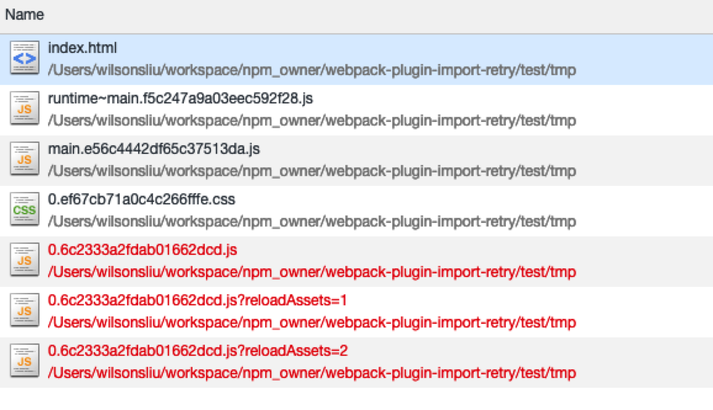

# webpack-plugin-import-retry

webpack plugin to modify webpack_require module to retry import async chunk again

`webpack` 插件，修改 `webpack`内置的脚本加载器，达到 `import` 时，如果加载异常，进行资源请求重试。

## Installation

With npm

```shell
npm install webpack-plugin-hash-output --save-dev
```

With yarn

```shell
yarn add webpack-plugin-hash-output --dev
```

## 截图 screenshot



## why?

许多时候用户网络较差，导致请求资源时失败，在用户量较大的时候这个问题会更加明显。

同时也会因为各种问题导致 CDN 域名不可访问，此时可降级请求当前域名的资源，可访问成功。

因此，资源重试显得非常有必要，这个事情可以通过封装 `import()` 完成，大家共同调用封装后的函数，但是需要大家都遵守规范。

这种方式也不利于使用 注释的功能 即 `import(/* webpackChunkName: "floatIndex" */'./views/floatIndex.vue')`。

因此，更好的解决方案，可以采用改写`webpack`异步加载的 `requireEnsure`函数来实现。

本插件即改写了 `requireEnsure`来实现，资源加载失败，重试 2 次，第二次采用当前域名的方式来实现。

针对一个`chunk`包含`css`与`js`两块资源的时候，两者任一资源重试 2 次失败则不再进行重试。

## Options

### options.cdnDomain

有值且未传入 `fmtRequireUrlFuncStr` 时，默认第二次重载时将 `cdnDomain` 替换为 `location.hostname`

### options.fmtRequireUrlFuncStr

格式化资源 `URL`,传入则会替换默认的格式化函数。

入参

```javascript
// 默认的函数
function(htmlNode, chunkId, __webpack_require__, options){
        var modifyReloadQry = function(url, reloadTimes){
            if(/reloadAssets=(\d+)&?/.test(url)){
                return url.replace('reloadAssets='+reloadTimes, 'reloadAssets='+(1+reloadTimes));
            }
            return url + (url.indexOf('?')!=-1 ? '&':'?') + 'reloadAssets='+(reloadTimes+1);
        }
        options = options || {
            LINK: 0,
            SCRIPT: 0
        };
        var nodeName = htmlNode.nodeName;
        var reloadTimes = options[nodeName] || 0;
        var linkKey = 'src';
        if(nodeName =='LINK'){
            linkKey = 'href';
        }
        if(!htmlNode[linkKey]) return;
        if(reloadTimes == 0 || reloadTimes > 2) return;
        var replaceUrl = modifyReloadQry(htmlNode[linkKey], reloadTimes-1);
        htmlNode[linkKey] = replaceUrl;
    }
}
```

## 对于其他资源，可以配合 assets-reload?
另外一个资源加载重试的组件 [assets-reload](https://www.npmjs.com/package/assets-reload)
 本模块通过 script, link, img等标签上的 onerror回调来进行资源加载重试，并且规则可定制。
